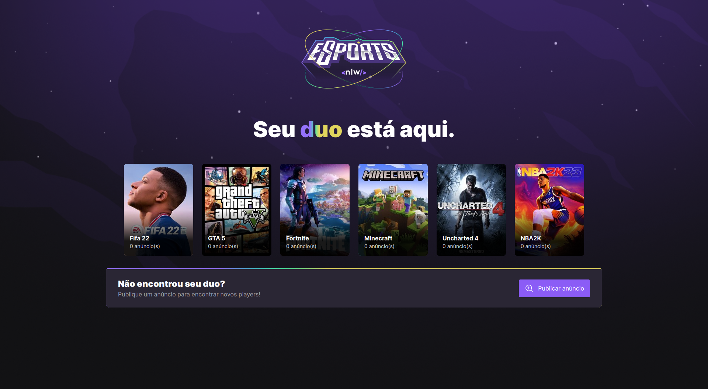
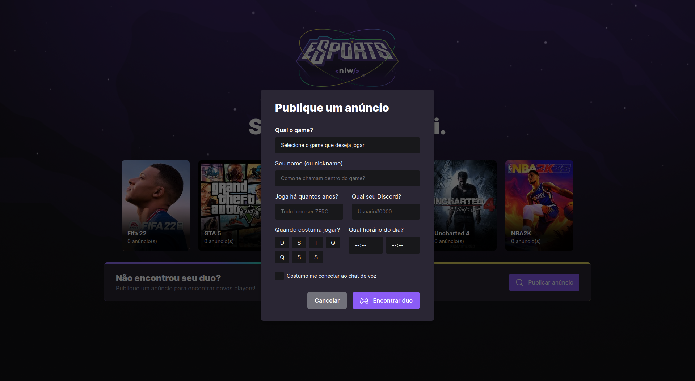
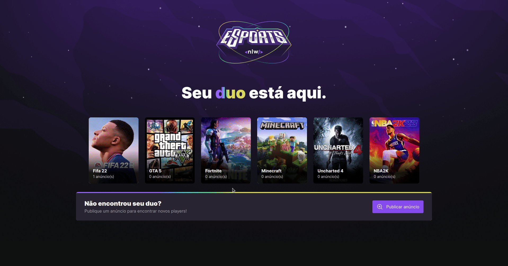
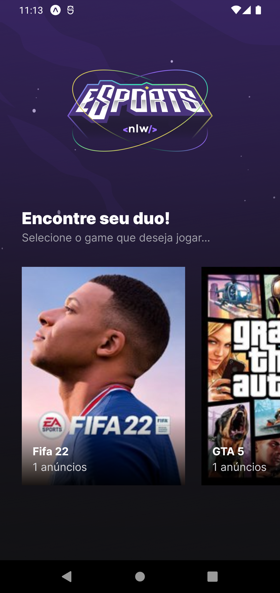
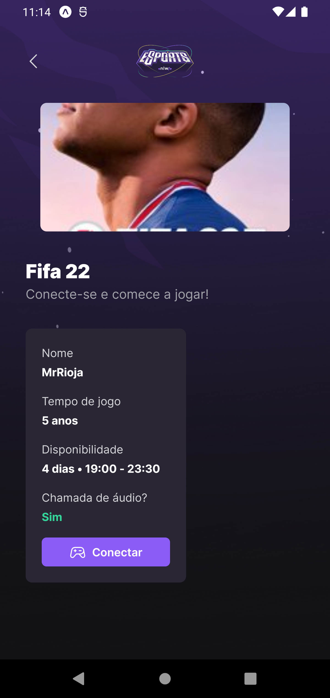
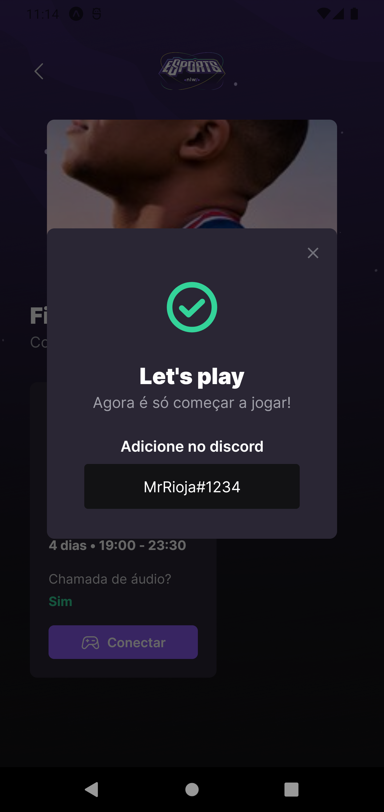
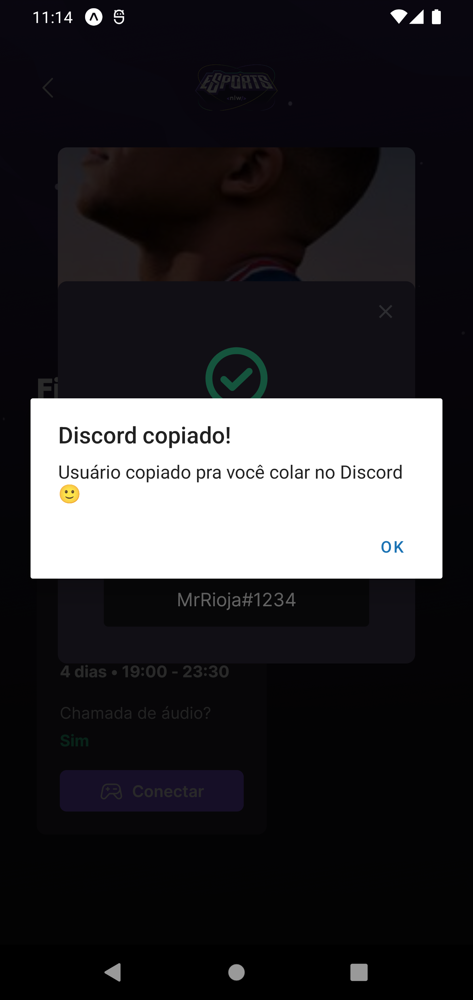
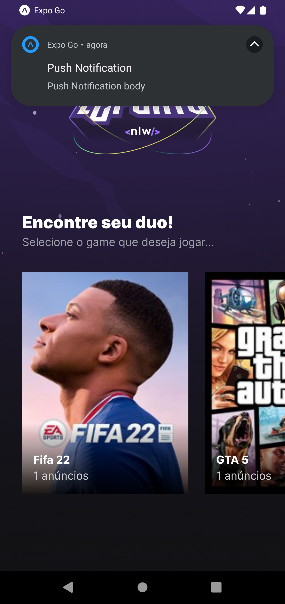

<p align="center">
  
  <br>
</p>
<h3 align="center">
Conecte-se com jogadores dos seus jogos preferidos!
</h3>

<p align="center">
  
  
  
  
</p>

<p align="center">
  <a href="#sobre">Sobre</a> •
  <a href="#nlw-esports">NLW eSports</a> •
  <a href="#instalação">Instalação</a> •
  <a href="#tecnologias">Tecnologias</a> •
  <a href="#autor">Autor</a>  
</p>

## Sobre

Projeto desenvolvido durante a NLW eSports, evento criado pela Rocketseat. Um evento 100% online e GRATUITO, com conteúdo exclusivo e INÉDITO.

Ocorreu do dia 11 ao dia 18 de Setembro de 2022 e teve como intuito mostrar na prática o poder da stack NodeJS + ReactJS + React Native e como essas tecnologias podem te levar até os seus maiores objetivos como programador.


## NLW eSports

NLW eSports é uma plataforma cujo objetivo é unir jogadores dos mais variados games para que formem seus duos e conquistem suas vitórias em co-op em seus games preferidos.

A aplicação é composta por dois frontend: mobile e web, cada qual com suas funcionalidades particulares as quais serão apresentadas a seguir.

### NLW eSports - Web

A aplicação web do NLW eSports possui como responsabilidade o cadastro de novos anúncios. É aqui onde os jogadores cadastram seus jogos de interesse, suas informações como nickname e discord e os horários que costumam jogar. ao acessar a aplicação, o usuário irá se deparar com a homepage abaixo aonde serão exibidos os games já cadastrados por outros gamers e o número de anúncios que o game possui:



A única funcionalidade disponível na web é o cadastro de novos anúncios, que é feito através do formulário abaixo:



É através dele que o usuário preenche as informações que estarão disponíveis para os demais usuários que também se interessam pelo game ao qual o anuncio será criado, conforme exemplificado abaixo:


Após o preenchimento das informações, o anúncio será criado e já estará disponível para os outros usuários se conectarem e iniciar as partidas em co-op rumo às vitorias 🙃.

Para ilustrar a aplicação em funcionamento, deixo abaixo um GIF onde navego pelas funcionalidades do app:



### NLW eSports - Mobile

Vamos falar agora sobre o aplicativo mobile da NLW eSports, suas funcionalidade e responsabilidades. Começamos pela home, que é exibida assim que o usuário acessa o app, contém as mesmas informações da home web e a única diferença aqui é que os cards dos games são clicados, mas falaremos disso em tópicos futuros:



Ao clicar no game de interesse, será exibido para o usuários os anúncios criados na página web. Os cards de anúncios terão as informações do outro jogador e suas preferências, conforme podemos ver na imagem abaixo:



Ao clicar no anúncio de um jogador ao qual o usuário tem interesse de fazer um duo, o Discord do mesmo será exibido no modal abaixo:



E pronto, o usuário já pode entrar em contato com o outro player para iniciarem suas jogatinas. Ao clicar no username do Discord do outro jogador, ele é copiado para a área de transferência facilitando assim a busca no Discord:



O app também conta com um sistema de push notification pré implementado porém até então não funcional, conforme mostrado a seguir:



Por fim, deixo um GIF navegando pela aplicação mobile e mostrando suas funcionalidades:


## Instalação

Antes de começar, você vai precisar ter instalado em sua máquina as seguintes ferramentas:
[Git](https://git-scm.com), [Node.js](https://nodejs.org/en/).
Além disso é bom ter um editor para trabalhar com o código como [VSCode](https://code.visualstudio.com/).

### 🎲 Rodando o Back End (servidor)

```bash
# Clone este repositório
$ git clone git@github.com:MrRioja/nlw-esports.git

# Acesse a pasta do projeto no terminal/cmd
$ cd nlw-esports

# Vá para a pasta server
$ cd server

# Instale as dependências
$ npm install
# Caso prefira usar o Yarn execute o comando abaixo
$ yarn

# Execute a aplicação em modo de desenvolvimento
$ npm run dev
# Caso prefira usar o Yarn execute o comando abaixo
$ yarn dev

# O servidor inciará na porta 3333 - acesse <http://localhost:3333>
```

### 🖥️ Rodando o Front End (Web)

```bash
# Clone este repositório
$ git clone git@github.com:MrRioja/nlw-esports.git

# Acesse a pasta do projeto no terminal/cmd
$ cd nlw-esports

# Vá para a pasta web
$ cd web

# Instale as dependências
$ npm install
# Caso prefira usar o Yarn execute o comando abaixo
$ yarn

# Execute a aplicação em modo de desenvolvimento
$ npm run dev
# Caso prefira usar o Yarn execute o comando abaixo
$ yarn dev

# O servidor inciará na porta 5173 - acesse <http://localhost:5173>
```

### 📱 Rodando o App (Mobile)

```bash
# Clone este repositório
$ git clone git@github.com:MrRioja/nlw-esports.git

# Acesse a pasta do projeto no terminal/cmd
$ cd nlw-esports

# Vá para a pasta mobile
$ cd mobile

# Instale as dependências
$ npm install
# Caso prefira usar o Yarn execute o comando abaixo
$ yarn

# Execute a aplicação
$ yarn start

# Será aberto no terminal o menu do Expo onde poderá scanear o QR Code para executar o app diretamente no seu celular ou as opções de executar no emulador android ou iOS
```

## Tecnologias


<br><br><br><br><br><br>

## Autor

<div align="center">

<h1>Luiz Rioja</h1>
<strong>Backend Developer</strong>
<br/>
<br/>

<a href="https://linkedin.com/in/luizrioja" target="_blank">

</a>

<a href="https://github.com/mrrioja" target="_blank">

</a>

<a href="mailto:lulyrioja@gmail.com?subject=Fala%20Dev" target="_blank">

</a>

<a href="https://api.whatsapp.com/send?phone=5511933572652" target="_blank">

</a>

<a href="https://join.skype.com/invite/tvBbOq03j5Uu" target="_blank">

</a>

<br/>
<br/>
</div>
